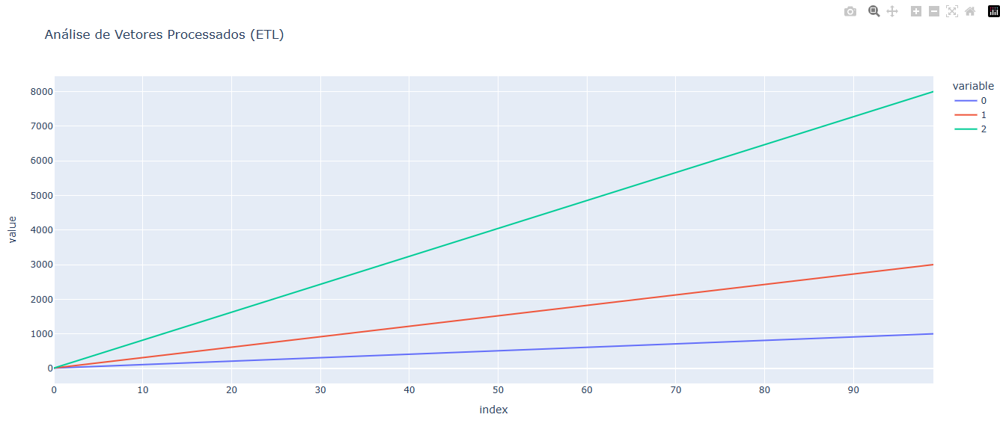

# 📊 NumPy Data Pipeline & Visualization

Este projeto implementa um pipeline de dados (ETL) automatizado utilizando Python. O script é capaz de gerar dados sintéticos, processar grandes volumes de informações vetoriais utilizando **NumPy** e exibir os resultados em um dashboard interativo com **Plotly**.



## 🚀 Funcionalidades

* **Geração de Dados (Mock):** O sistema verifica a existência dos dados; caso não existam, gera arquivos sintéticos automaticamente para simular sensores ou fontes externas.
* **Processamento Vetorial:** Utilização de `NumPy` para leitura otimizada e manipulação de matrizes (Stack & Transpose).
* **Visualização Interativa:** Geração de gráficos dinâmicos com `Plotly`, permitindo análise visual dos vetores processados.

## 🛠️ Tecnologias Utilizadas

* **Python 3.x**
* **NumPy:** Computação científica e manipulação de arrays.
* **Plotly:** Visualização de dados interativa.
* **Pandas:** Manipulação e análise de dados.

## 📦 Como Executar

### 1. Clone o repositório
```bash
git clone [https://github.com/SEU-USUARIO/Python-Vector-Data-Processor.git](https://github.com/SEU-USUARIO/Python-Vector-Data-Processor.git)
cd Python-Vector-Data-Processor